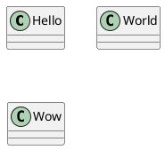

# Danielsan80

Prova2

```puml
@startuml
class Hello
class World
class Wow
@enduml

{% for post in site.posts %}
    ### {{ post.date | date_to_string }}
    [{{ post.title }}]({{ post.url }})
{% endfor %}
```
